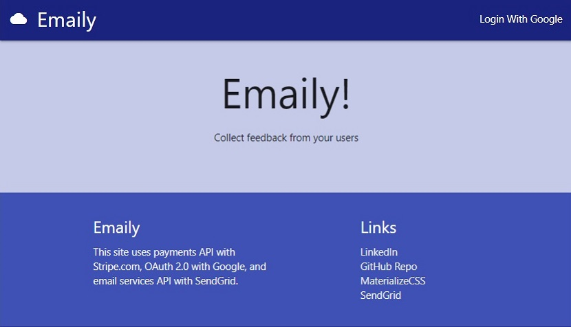
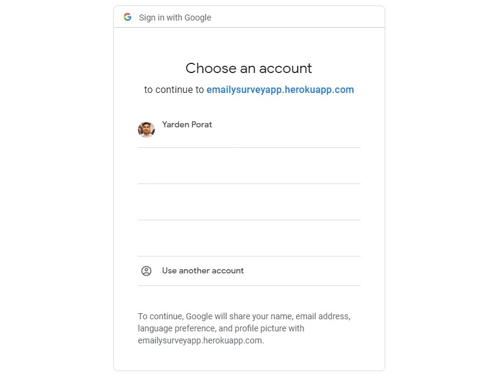
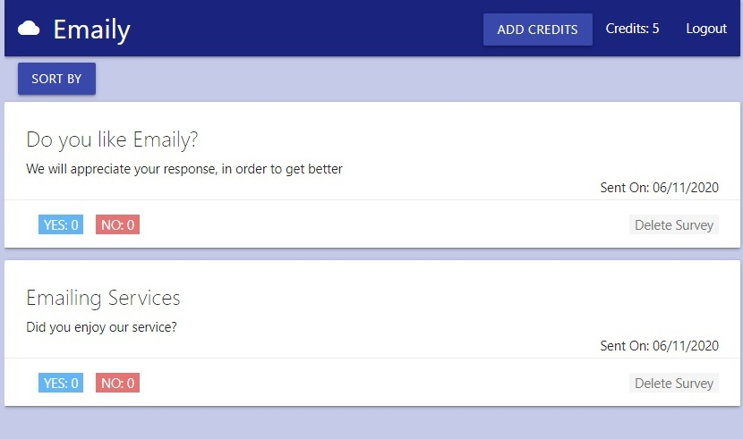

<h1 align="center">
    Emaily
</h1>

  <a href="#-tech-stack">Tech Stack</a>&nbsp;&nbsp;&nbsp;|&nbsp;&nbsp;&nbsp;
  <a href="#-the-project">Live working demo</a>

 

  

 

## 💻 The Project

Emaily is a platform for sending surveys in bulk emails, to gather client feedback.
Insert credit card number: "4242 4242 4242 4242" to get free credit and experiment with the app

<h2 align="center">
  <a href="https://emailysurveyapp.herokuapp.com/">Emaily - Live App on Heroku</a>
</h2>

 

## 🚀 Tech Stack

| Back End                                 | Front End                                                    | API's                                                                       |
| ---------------------------------------- | ------------------------------------------------------------ | --------------------------------------------------------------------------- |
| [Node.js](https://nodejs.org/en/)        | [React.js](https://reactjs.org)                              | [Stripe](https://stripe.com/)                                               |
| [Express.js](https://expressjs.com/)     | [Redux](https://redux.js.org/)                               | [SendGrid](https://sendgrid.com/)                                           |
| [PassportJS](http://www.passportjs.org/) | [Redux Form](https://redux-form.com/)                        | [Google OAuth 2.0](https://developers.google.com/identity/protocols/oauth2) |
| [MongoDB](https://www.mongodb.com/)      | [Redux Thunk](https://github-images.com/reduxjs/redux-thunk) |
| [Mongoose](https://mongoosejs.com/)      |                                                              |

 

  
    
    
    
    
    

